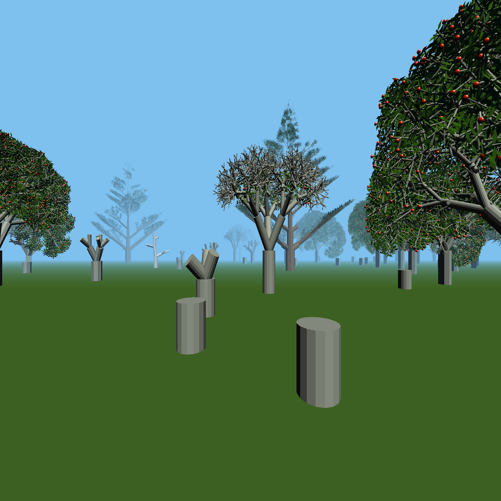

# Forest-Walk Project User Manual
This repository contains the code for my submission to COMP 3931. There are two progams: the L-system editor and the forest simulator. Both have been developed for Linux, however the use of cross-platform libraries means that, in theory, this project should be compilable on Windows and Mac as well.
The UI for both programs was developed in QT 5.1. You should have this installed on your machine before building.

# L-system Editor (l-system-editor)
The L-system editor, as the name suggests, is a program which allows you to create and edit L-systems. To build the L-system editor, navigate to the root directory (/forest-walk/) of the project in a terminal. Then enter the following commands:
~~~~
cd Editor
qmake
make
~~~~
To run the editor, enter the command:
~~~~
./l-system-editor
~~~~

## Creating an L-system
There are three steps to creating an L-system in the editor. The first is to define your L-system's axiom, which can be done by entering it into the axiom text field. The second is to define your L-system's productions. To do so, there is initially one production field at the bottom of the interface. The add production button can be pressed to add a production field to the UI, with a maximum of 16. The minus button at the ends of each production field can be pressed to remove it. The final step, once all of your productions are defined, is to press the reload productions button. This will convert any expressions in your productions from infix to postfix.

There are 6 text fields in a single production field. The first 3 define the production's predecessor. The first and third boxes contain the predecessor's left and right contexts respectively. The fourth is the production's successor string. The fifth is the production's condition. The sixth is the production's probability. For stochastic productions, the probability value will be less than one and all stochastic productions which match a given predecessor should be grouped together. This is because the L-system derivation algorithm assumes that these productions will follow one after the other.

Once the reload productions button has been pressed, the L-system can be visualised. By pressing the derive button, a string held in memory, starting from the axiom, is derived. The derived string is then interpreted and visualised in the display widget.

Once defined, the L-system can be saved to a file. The file extension for an L-system specification is .lsys. For subsequent editing, the L-system can be loaded from the file and amended.

The capture button, when pressed, renders the contents of the display widget and saves the image to a file called "image.ppm". Unfortunately, this means that if you want more than one image to be captured in a single session, the image file would have to be renamed or moved.

## Input language
The alphabet which is accepted by the program consists of parameterised "module" strings. A module is a single letter, with between 0 and 8 parameters. A parameter can be given as a real value or a parameterised expression.  Examples include @, F(0.5, 0.1), I(d) and A(t+1, q^(-x), 1.0). A production's successor can contain arithmetic expressions which are computed when the string in memory is derived. Any parameter symbols which appear in the successor must appear in only one of the predecessor fields. A branching structure can be described in a string by putting the contents of a branch between [ and ].

The models generated by the editor are done so with a LOGO-like turtle algorithm. This algorithm has a set list of symbols which correspond to instructions. The list of instructions and their symbols are as follows:

* **F(x,y)**: Move turtle forward by distance x and render a cylinder with length x and radius y. If y is not specified, then the radius defaults to a value stored within the turtle's state.
* **f(x)**: Move turtle forward by distance x but doesn't render a cylinder.
* **@(x)**: Render a sphere with radius x at the turtle's current position.
* **+(x)**: Turn the turtle left by x degrees.
* **-(x)**: Turn the turtle right by x degrees.
* **&(x)**: Roll the turtle forward by x degrees.
* **^(x)**: Roll the turtle backwards by x degrees.
* **/(x)**: Roll the turtle left by x degrees.
* **\\(x)**: Roll the turtle right by x degrees.
* **[**: Push the turtle's state onto a pushdown stack.
* **]**: Pop the top state from the pushdown stack and make it the turtle's current state.
* **{**: Begin saving the turtle's positions as vertices for a polygon.
* **}**: Fill the polygon.
* **.**: Store the turtle's current position as a polygon vertex. This only works when in between { and }. Currently, the only polygons which can be defined are quads, so a polygon will only be correctly drawn if four of these appear between { and }.
* **!(x)**: Change the default cylinder radius value to x.

# Forest Simulator (forest-walk)
The forest simulator is a program which procedurally generates a forest.
To build the forest simulator, navigate to the root directory of the project in a terminal. Then enter the following commands:
~~~~
cd Core
qmake
./build.sh
~~~~
After entering the final command, a prompt with the text "gen stack code?" will be displayed. Just press enter to skip past it.
To run the simulator, enter the command:
~~~~
./forest-walk
~~~~

## Simulation
The simulation works by treating each tree in the forest as a circle. This circle represents the reach a tree has to gather resources from its environment. When two of these circles intersect, the smaller one is considered dominated and may die as a result. A tree enters its old age when its circle radius exceeds or equals a constant maximum radius, which is species specific. The species which are modelled are pine, birch and rowan. 

The ecosystem can be iterated by the number of time steps given in the spin box next to the derive button. The button is labelled as derive because the L-system algorithm is reused to iterate the ecosystem simulation, which itself is an L-system. Pressing the reset button sets the ecosystem back to its initial condition, as it was when the program was executed. The capture button here works the same way as in the L-system editor.

There are 4 more rows of widgets which can be interacted with. The second of these concerns the ecological phenomena that should be seen in the ecosystem. The self-thinning option, when turned on, will cause the domination checking algorithm to be executed. The propagation option controls whether trees propagate. Succession is defined as the ecological process by which the species structure of an ecosystem changes. Succession is an emergent property of the simulation and there are two values for each species of tree which determines how succession occurs. These are shade tolerance and longevity. Turning the succession option off means that these values are not considered when computing the simulation. The other 3 rows of widgets concern visualisation options.

## Visualisation
The forest is visualised in two ways. The first is the circle representation, or coarse model, which is displayed if the chart mode radio button is pressed. This coarse model can be interpreted as a visualisation of the forest's canopy. The dark green circles represent pine trees, the light green circles represent birches and the pink circles represent rowan trees. The chart controls row of widgets affect the coarse visualisation. If show domination is checked, then dominated trees appear red and if show old age is checked, then trees which have entered old age will appear noticeably darker. The ecosystem is split into buckets by a spatially partitioning grid. By checking show grid, this grid is visualised as part of the chart. Checking show view range will show details about the 3D visualisation of the forest. These details are the view position, the field of view and the grid buckets of trees to render.

If the forest mode radio button is pressed, then the display will change to a 3D visualisation of the forest. Tree models are generated using the same algorithm as in the L-system editor.

Sliding the slider in the 3D controls row of widgets will extend or retract the render distance in the forest mode. Fog obscures the distant trees and this slider directly manipulates it. The apply L.O.D (level of detail) option allows a performance increase by generating less detailed tree models if they are further away from the view position. Turning this option off will cause all the tree models to be generated at their highest level of detail.
